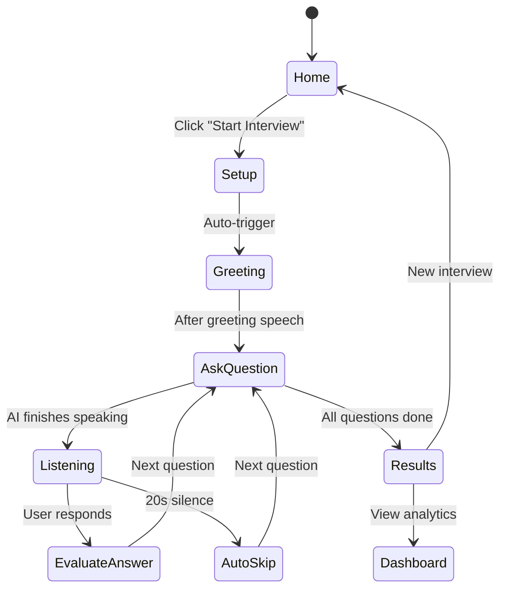

# AI Interview Platform — Full Upgrade

Upgrade the Streamlit-based AI Interview application to behave like a real, fully-automatic interview system with side-by-side video, automatic voice flow, silence detection, and multi-language support.

## User Review Required

> [!IMPORTANT]
> **Voice engine choice**: The current app uses `pyttsx3` for text-to-speech. This is a local, offline engine — it works well on Windows but blocks the Streamlit thread while speaking. We will run TTS in a background thread to keep the UI responsive. If you'd prefer `gTTS` (Google cloud-based, sounds more natural but requires internet), let me know.

> [!WARNING]
> **WebRTC limitations**: `streamlit-webrtc` requires a TURN/STUN server for non-localhost deployments. For local development this works fine. The webcam feed will be real; the "AI Interviewer" panel will be an animated avatar (since there is no actual AI video to display).

> [!IMPORTANT]
> **Language support**: You requested English, Hindi, and Gujarati. The `pyttsx3` engine on Windows supports English and Hindi via SAPI5 voices (if installed). Gujarati TTS is not natively supported by `pyttsx3` or Google Speech Recognition. For Gujarati, we will: generate questions in Gujarati text, use English TTS as fallback, and accept Gujarati speech via Google STT (`gu-IN` locale). Please confirm this approach is acceptable.

## Proposed Changes

### Component 1: UI Layout & Navigation

---

#### [MODIFY] [main.py](file:///c:/Users/Administrator/Downloads/interview_platform%20(1)/interview_platform/main.py)

Complete rewrite of the main orchestrator:

- **Sidebar navigation** using `st.sidebar.radio()` with 3 pages: `Home`, `Interview`, `Dashboard`
- **Home page**: Welcome hero section with greeting based on system time (Good Morning/Afternoon/Evening), domain & difficulty selectors, language selector (`English`, `Hindi`, `Gujarati`), and a prominent "Start Interview" button
- **Interview page**: Full Zoom-like UI with side-by-side video (`st.columns(2)`), automatic interview flow, real-time question display, answer transcript, and progress tracking
- **Dashboard page**: Interview history, score trends, domain radar chart, detailed response review
- **Profile section** in sidebar footer with logout
- **Session state management** for: `interview_started`, `current_question_index`, `answers`, `selected_language`, `interview_phase`, `silence_timer`

### Component 2: Side-by-Side Video Interface

---

#### [MODIFY] [ui_components.py](file:///c:/Users/Administrator/Downloads/interview_platform%20(1)/interview_platform/app/utils/ui_components.py)

- Replace stacked video layout with `st.columns(2)` side-by-side layout
- **Left column**: AI Interviewer panel with animated avatar (pulsing ring when speaking, idle otherwise), name label, speaking indicator
- **Right column**: User webcam via `streamlit-webrtc` with `SENDONLY` mode (video only, lighter weight), name label overlay
- Top bar with interview title + live timer
- Bottom toolbar with visual control buttons
- Transcript panel showing current AI question with slide-in animation

### Component 3: Automatic Interview Flow Engine

---

#### [MODIFY] [interview_engine.py](file:///c:/Users/Administrator/Downloads/interview_platform%20(1)/interview_platform/app/interview/interview_engine.py)

- Add **time-based greeting** logic: checks system time → generates "Good Morning/Afternoon/Evening"
- Add **automatic flow**: Start → Greeting → "Let's begin your interview" → Ask Q1 → Listen → (auto-advance on 20s silence) → Ask Q2 → … → End
- Add **silence detection timer**: 20-second timeout via `speech_recognition` `timeout` parameter
- Remove manual "TRIGGER VOICE INTERACTION" button requirement — flow is fully automatic after clicking "Start Interview"
- Background thread for TTS to avoid blocking the Streamlit UI
- Track `has_greeted`, `auto_advance`, `silence_timeout_count` in session state

### Component 4: Voice Engine Upgrade

---

#### [MODIFY] [voice_engine.py](file:///c:/Users/Administrator/Downloads/interview_platform%20(1)/interview_platform/app/utils/voice_engine.py)

- Add Gujarati language code mapping (`gu-IN`)
- Update `listen()` with 20-second `timeout` parameter for silence detection
- Add `speak_async()` method using `threading.Thread` so TTS doesn't block the UI
- Add `set_language()` to switch TTS voice based on selected language
- Improve error handling with specific fallback messages

### Component 5: Question Bank Update

---

#### [MODIFY] [question_bank.py](file:///c:/Users/Administrator/Downloads/interview_platform%20(1)/interview_platform/app/interview/question_bank.py)

- Update `get_languages()` to return `["English", "Hindi", "Gujarati"]`
- Questions remain in English (the language selection affects TTS voice and STT recognition locale)

### Component 6: CSS Enhancements

---

#### [MODIFY] [styles.css](file:///c:/Users/Administrator/Downloads/interview_platform%20(1)/interview_platform/static/styles.css)

- Add side-by-side video panel styles
- Add speaking animation (pulsing glow ring)
- Add transcript slide-in animation
- Add "listening" indicator animation (pulsing microphone icon)
- Add interview progress bar gradient
- Responsive adjustments for the two-column video layout

## Architecture: Interview Flow State Machine

## Open Questions

> [!IMPORTANT]
> 1. **Number of questions per interview**: Currently 5. Should this remain 5, or would you like it configurable?
> 2. **Resume Analyzer page**: Your instructions mention Home, Dashboard, Interview — but the app currently has a Resume Analyzer page too. Should we keep it as a 4th nav item, or remove it?

## Verification Plan

### Automated Tests
- Run `streamlit run main.py` and verify the app launches without errors
- Test the full interview flow: Home → Start → Greeting → Questions → Results → Dashboard
- Verify side-by-side webcam layout renders correctly
- Test language switching (English/Hindi/Gujarati)
- Verify 20-second silence auto-skip works
- Check all session state transitions

### Manual Verification
- Visual inspection of the side-by-side video layout in browser
- Confirm TTS speaks correctly in selected language
- Confirm STT captures responses properly
- Test "End Interview" button terminates session cleanly
